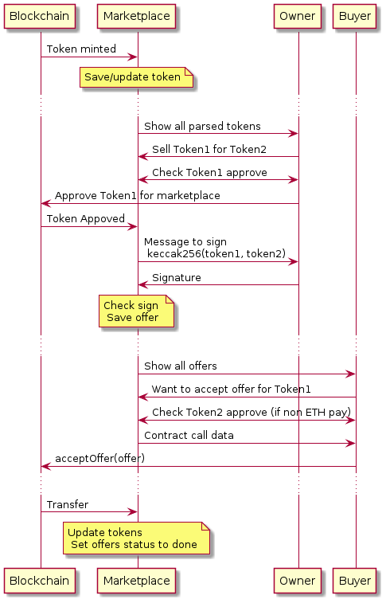

Когда юзер хочет продать токен1 за токен2    
_(токен1 может быть любым из erc20, erc721 или erc1155, токен2 еще и ETH)_  
_(токен1 и токен2 должны быть approved для смартконтракта marketplace)_

он подписывает OrderData для обоих токенов и отдает подпись в бд.
_Подпись - keccak256(abi.encodePacked(все поля из OrderData обоих токенов))_

Юзер, желающий принять оффер отправляет OrderData для обоих токенов и подпись создателя оффера на смартконтракт Marketplace:
`acceptOffer(token1, token2, signature)`

